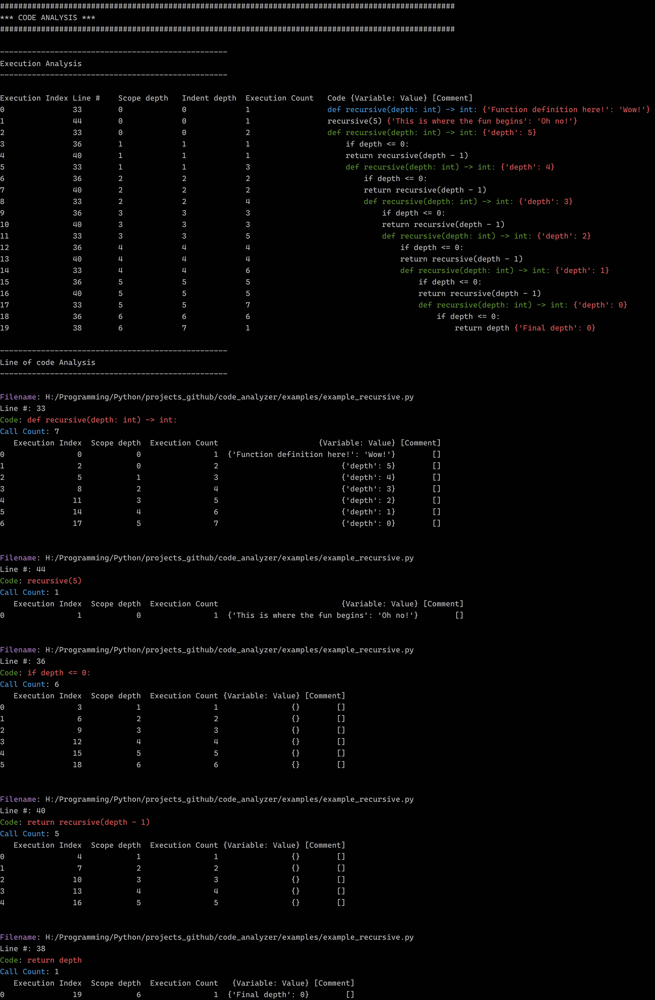

# Code Analyser

#### What is this?
A Python code that allows you to visually see how your code works after the execution of your code.

#### Why would you use this?
Let's say you don't want to use the debugger, and you want to see how your code runs line by line printed out easily
and neatly. You can import this module and add a few lines of code to initialize the analyzer and run your code, and
you will get a simple print analysis of your code in your terminal or in a file.

#### Requirements:
    python>=3.6
    rich
    colorama
    pandas

#### Example?

    from code_analyzer import CodeAnalyzer
    
    code_analyzer = CodeAnalyzer()
    code_analyzer.start()
    
    
    def add(x: int, y: int):
        result = x + y
        code_analyzer.record_comment_for_interpretable_previous({"result": result})
        code_analyzer.record_comment_for_interpretable_previous(f"Result {result}")
    
        for i in range(1):
            x = i
    
        return result
    
    
    add(1, 2)
    add(42, 8)
    add(5, 6)
    
    code_analyzer.stop()
    code_analyzer.print()

Or just check the examples folder...

#### Notes

In the output of a print or an export:
Blue background behind code is a callable's definition
Green background behind code is a callable being executed

#### Output

__TODO:__

